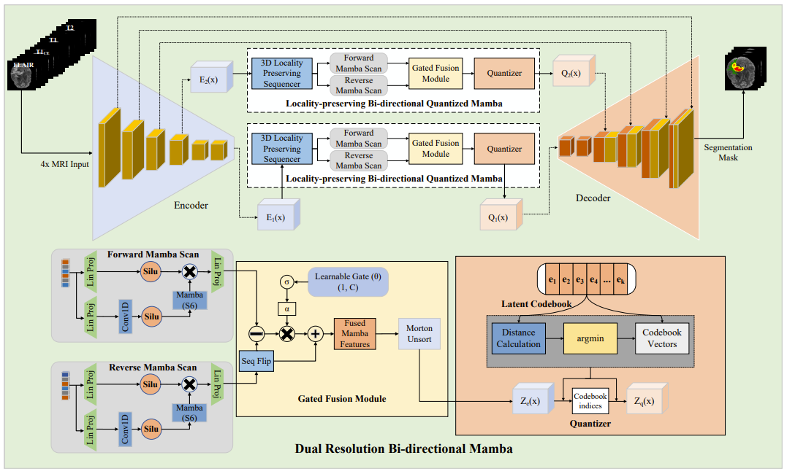

# DRBD-Mamba: Dual-Resolution Bi-directional Mamba for Efficient Brain Tumor Segmentation

This repository provides the official PyTorch implementation of **DRBD-Mamba**, a dual-resolution bi-directional Mamba-based architecture for 3D brain tumor segmentation from multimodal MRI scans.

The code is released to support **reproducibility, transparency, and further research**, and corresponds to the experiments reported in our paper.
---

## Key Features
- Dual-resolution bi-directional Mamba blocks integrated into a 3D encoder–decoder architecture
- Morton space-filling curve (SFC) for locality-preserving voxel sequence modeling
- Vector Quantization (VQ) block for latent regularization
- Systematic five-fold cross-validation protocol for fair evaluation
- Detailed per-case evaluation with Dice and HD95 metrics
- Computational efficiency analysis (FLOPs, parameters, runtime)

---

## Architecture Overview

The overall architecture of **DRBD-Mamba** is illustrated below.  
The model integrates dual-resolution bidirectional Mamba blocks within a 3D encoder–decoder framework, combined with Morton space-filling curve (SFC) ordering and a vector quantization (VQ) module for latent regularization.

<p align="center">
  
</p>

## Environment Setup

We recommend using a dedicated virtual environment.

```bash
# Create virtual environment
python3 -m venv drbd_mamba_env

# Activate environment
source drbd_mamba_env/bin/activate

# Upgrade pip
pip install --upgrade pip

# Install dependencies
pip install -r requirements.txt

## Stage 1: VQ-VAE Training

To train the VQ-VAE component, edit `run.sh` and ensure:

- `--VQVAE` is **enabled**
- `--vqvae_training` is **enabled**
- Other training flags (LDM, conditional training) are disabled

Example:
```bash
VQVAE="--VQVAE"
VQVAETRAINING="--vqvae_training"

# Comment out inference-related flags
# LDMTRAINING="--ldmtraining"
# CONDTRAINING="--cond_training"

bash run.sh


This makes your pipeline **explicit**.

---

## 4️⃣ Inference using the trained VQ-VAE

Now explain inference cleanly.

```markdown
### Stage 2: Inference with Trained VQ-VAE

After VQ-VAE training is completed:

1. Edit `run.sh`
2. Comment out the training flag:
```bash
# VQVAETRAINING="--vqvae_training"


